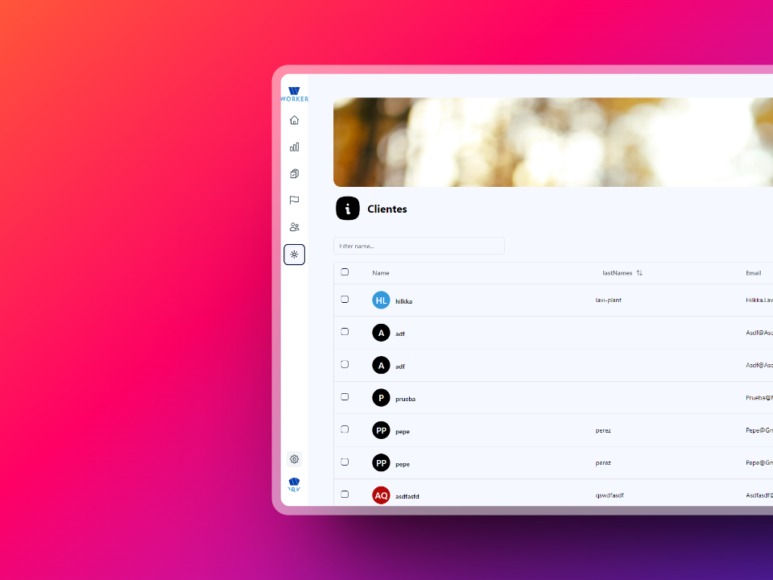

# Nombre del Proyecto

Este es un proyecto de React que utiliza la API de PocketBase para obtener y mostrar una lista de clientes.



# Instalación

Para instalar las dependencias del proyecto, ejecuta:

```bash
pnpm install
```

# Uso

Para iniciar el servidor de desarrollo, ejecuta:

```bash
pnpm run dev
```

Abre http://localhost:3000 para verlo en el navegador.

# Características

- Muestra una lista de clientes obtenida de la API de PocketBase.
- Utiliza useMemo para memorizar los datos de los clientes y evitar peticiones innecesarias a la API.

# Contribución

Las contribuciones son bienvenidas. Por favor, abre un issue o un pull request para sugerencias o cambios.

# Licencia

Este proyecto está licenciado bajo la licencia MIT.

- [ ] Change header background.
  - [ ] Adding splash api, background colors, and shades.
- [ ] Make a calendar, with google calendar api or own.
- [ ] Works page for client.
- [ ] Reveneus page.
- [ ] Notification systems for works, alerts, etc.
- [ ] Page for all Works.
- [ ] Add light mode and dark mode.
- [ ] Add settings page for change some configurations.
- [ ] Add a quest for client´s feedback.
- [ ] Add liveChat.
- [ ] Add option in home page to change from table to cards.
- [ ] Add work form to post new work for user.
- [ ] Add form to add new user.
- [ ] Lenguage support.
- [ ] Tests.
- [ ] Edit existing clients.
- [ ] kaban
- [ ] Make skeletons for loading.

# Fixes

- [x] Component loading in client page (don´t wait to load all page, wait only for component)
